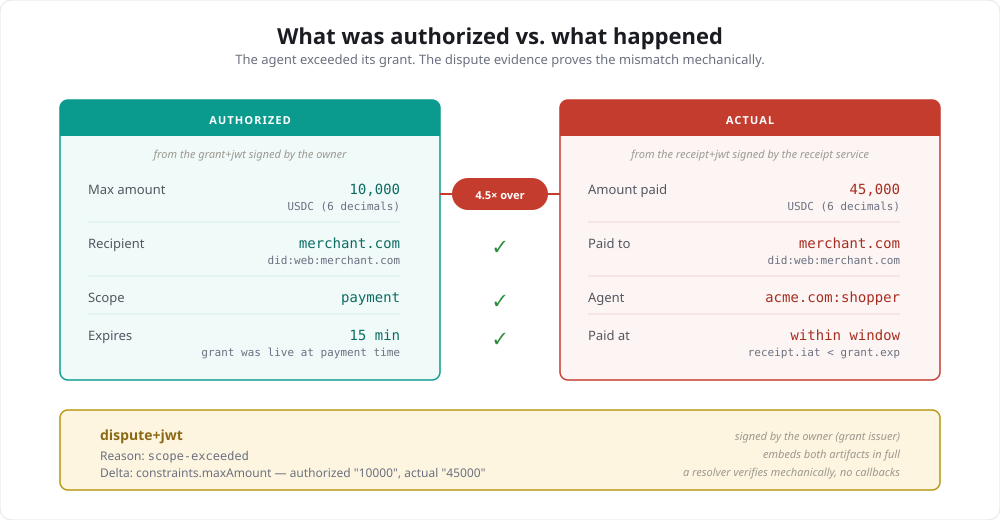

**Status: proposal draft.**

# Dispute resolution for agent payments

## Motivation

When an AI agent makes a purchase that doesn't match user intent, no
existing chargeback reason code covers it. The payment was
authenticated, authorized, and completed — no fraud occurred. But the
agent acted outside the scope the user granted.

This is not a single-protocol problem. Every machine payment protocol
being built right now — ACK, MPP, x402 — handles the forward flow
and stops at the receipt. None of them answer "what happens when the
agent was wrong?"

The gap is structural: the artifacts that prove a payment happened
don't carry enough information to prove it shouldn't have. What's
missing is a machine-readable format for the mismatch between
authorization and action, and a verification path a third party can
walk without callbacks to either side.

## The evidence triple

The core concept is protocol-agnostic. A dispute evidence artifact
binds three things:

1. **Authorization scope** — what the user authorized the agent to do
2. **Action** — what the agent actually did (the payment receipt)
3. **Delta** — a structured, machine-readable description of which
   constraints were violated and by how much

A resolver verifies the evidence mechanically: extract the named field
from each embedded artifact and confirm the values differ. No
natural-language interpretation. No callbacks. No external state.

Each protocol maps this triple to its own primitives. See
[protocol-mappings.md](protocol-mappings.md) for MPP and x402.
The reference implementation below uses ACK's grant/receipt model.

## Design guidelines

1. **Layer, don't fork.** Dispute evidence is an extension artifact
   that layers on each protocol's existing artifacts. No changes to
   core protocol flows.

2. **Evidence, not verdicts.** The protocol generates verifiable
   evidence of a mismatch. Whether that evidence warrants a refund is
   a business decision above the protocol.

3. **Mechanical verification.** A resolver can verify every claim in
   the evidence by extracting fields from the embedded artifacts and
   comparing values. No natural-language interpretation required.

4. **Same verification infrastructure.** Dispute evidence uses the
   same signature and key resolution primitives each protocol already
   defines. No new cryptographic mechanisms.

5. **Fail closed on missing evidence.** If either artifact is missing,
   tampered, or doesn't match its reference, the entire dispute is
   rejected. There is no partial-evidence path.

## Document map

| Section | Location |
|---|---|
| Reference spec (ACK implementation) | [ext-disputes.md](ext-disputes.md) |
| Protocol mappings (MPP, x402) | [protocol-mappings.md](protocol-mappings.md) |
| Working example (jose) | [example.ts](example.ts) |

## Cross-protocol issues

| Protocol | Issue | Status |
|---|---|---|
| ACK | [agentcommercekit/ack#217](https://github.com/agentcommercekit/ack/issues/217) | Open |
| MPP | [tempoxyz/mpp-specs#359](https://github.com/tempoxyz/mpp-specs/issues/359) | Open |
| x402 | [x402-foundation/x402#3500](https://github.com/x402-foundation/x402/issues/3500) | Open |

## Settled decisions

1. **Dispute evidence is a JWT, not a VC.** Consistent with ACK v2's
   move from Verifiable Credentials to plain JOSE. A lossless
   VC mapping can live in ext-attestations if needed.

2. **The disputant signs.** The disputant (grant issuer / principal)
   is the only party with standing to claim a mismatch.

3. **Artifacts are referenced by content hash.** The evidence embeds
   both artifacts in full and binds them by SHA-256. A forged artifact
   won't match the reference.

4. **Deltas are structured, not narrative.** Each delta entry names
   a field, an authorized value, and an actual value. A resolver
   verifies mechanically. This trades expressiveness for
   verifiability.

5. **Reason codes are extensible.** Unrecognized codes don't cause
   rejection. The delta is self-describing.

6. **Only mechanically verifiable mismatches.** Category mismatch and
   "no grant" were deliberately excluded — neither can be verified
   by comparing fields in the embedded artifacts.

7. **Evidence expires.** 90-day SHOULD, matching common chargeback
   windows.

## Dependencies (ACK reference implementation)

The ACK spec depends on:

- **ACK-ID core** — grants, artifact references, key resolution
- **ACK-Pay core** — receipt `ack` binding, payment request embedding

Both are proposed in [RFC: ACK-ID + ACK-Pay v2](https://github.com/agentcommercekit/ack/pull/179).

MPP and x402 have their own dependency paths — see
[protocol-mappings.md](protocol-mappings.md).

## Open questions for reviewers

- Should the offer-retention recommendation (Section 8) be a MUST?
  That strengthens dispute evidence but increases storage requirements
  for agents.
- Is 90 days the right evidence expiry window for agent commerce, or
  do autonomous agents need a shorter/longer window?
- Should the protocol define counter-evidence, or leave response
  mechanisms entirely to the resolution layer?
- For protocols without an authorization-scope artifact (MPP, x402):
  should the dispute extension introduce one, or reference an external
  format?
- **Attestation quality fields.** Should `observation_window` and
  `as_of` be REQUIRED or RECOMMENDED on tier 2 attestations? Required
  means every attestor must declare coverage and every resolver must
  evaluate it. Recommended keeps attestation quality as optional
  signal. Current position: RECOMMENDED, to avoid pushing policy
  decisions into the schema. (Raised by unblinkr, x402#3500.)
- **Canonicalization.** JCS (RFC 8785) for hashing canonical input
  sets. The open decision is which fields go in the canonical set and
  how absent fields are treated (omitted vs null vs empty). Amounts
  must be strings, not numbers, to avoid IEEE 754 precision loss.
  (Raised by unblinkr, x402#3500.)
- **Decision record liability.** The decision record (leg 3)
  strengthens disputes by proving the agent should have known. But it
  also creates a self-incrimination risk: if the record shows PASS
  when it should have been BLOCK, that's evidence against the agent.
  Agents are incentivized to not produce decision records. Should the
  spec address this tension, or leave it to the market?
