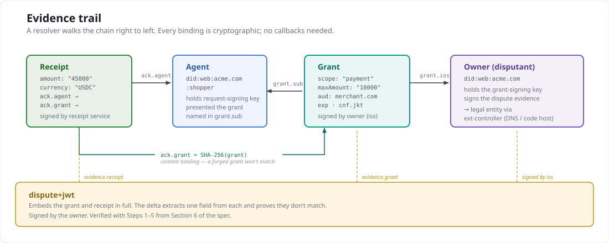

**Status: proposal draft.**

The key words MUST, MUST NOT, SHOULD, SHOULD NOT, and MAY
are used as defined in [RFC 2119](https://datatracker.ietf.org/doc/html/rfc2119).

# ext-disputes: dispute evidence for agent payments

This document layers on ACK-Pay core. It assumes the reader is familiar
with the `ack` binding (pay core Section 4), artifact references
(ACK-ID core Section 4.2), and grants (ACK-ID core Section 5).

## 1. Scope

This extension defines:

- A **dispute evidence artifact** — a signed JWT that packages the
  authorization scope (the grant), the action (the receipt), and a
  machine-readable description of the mismatch between them.
- **Reason codes** specific to agent commerce — the cases where an
  agent acted on a user's behalf but the action fell outside the
  authorized scope.
- A **verification checklist** for dispute evidence — what a resolver
  MUST check before treating the evidence as valid.

This extension does NOT define:

- **Resolution outcomes.** Whether a dispute leads to a refund,
  credit, or arbitration is a business layer above the protocol.
- **Intent capture.** A grant encodes authorization scope, not
  natural-language user intent. Capturing conversational intent
  is a harder problem worth a separate extension.
- **Fund reversal.** ACK receipts are attestations, not settlement
  instructions. Actual fund movement is the payment network's
  responsibility.
- **Multi-hop delegation.** If Agent A delegates to Agent B, the
  grant chain deepens. This extension assumes a single
  agent-to-owner grant.

The cost, stated openly: this extension adds one new artifact type and
one new verification path. It requires both parties to retain their
grant and receipt — the offer-retention question that pay core's open
decision #2 raises. An agent that discards the grant after payment
cannot later produce dispute evidence, and the protocol has no
re-issuance mechanism.

## 2. Terminology

- **Disputant** — the owner who authorized the grant and disputes
  the payment. The disputant is always the grant issuer.
- **Dispute evidence** — the signed artifact that packages the
  authorization-versus-action mismatch.
- **Delta** — a structured, machine-readable description of which
  grant constraint was violated and how.
- **Resolver** — any party that verifies dispute evidence. May be
  human, automated, or a combination.

## 3. Evidence trail

The dispute evidence artifact binds three signed objects into one
verifiable chain. A resolver walks the chain right to left; every
arrow is a cryptographic binding (signature or artifact reference).



The `grant_ref` binds by content (SHA-256 of the grant's compact
serialization, matching the receipt's `ack.grant`). The `receipt_ref`
binds by content (SHA-256 of the receipt's compact serialization).
Both the grant and receipt are embedded in full, so a resolver need
not fetch anything — the evidence is self-contained.

## 4. The dispute evidence artifact

A dispute evidence artifact is a JWS compact serialization signed by
the disputant (the grant issuer). The protected header carries
`typ: "dispute+jwt"` (per RFC 7515 §4.1.9, following core's
convention for artifact-typed JWTs). The payload carries:

```
-- Protected header --
{
  "alg": "EdDSA",
  "typ": "dispute+jwt",
  "kid": "<disputant's key thumbprint>"
}

-- Payload --
{
  "iss": "did:web:acme.com",
  "sub": "did:web:acme.com:shopper",
  "iat": 1726531200,
  "exp": 1727136000,
  "jti": "urn:uuid:550e8400-e29b-41d4-a716-446655440000",
  "reason": "scope-exceeded",
  "grant_ref": "kQ3v8Zt...",
  "receipt_ref": "pL9m2Xw...",
  "evidence": {
    "grant": "eyJhbGciOi...",
    "receipt": "eyJhbGciOi...",
    "delta": [
      {
        "field": "constraints.maxAmount",
        "authorized": "10000",
        "actual": "45000",
        "currency": "USDC"
      }
    ]
  }
}
```

The example is non-normative. The normative claim table follows.

### 4.1 Header

| Parameter | Requiredness | Rule |
|---|---|---|
| `typ` | REQUIRED | MUST be `dispute+jwt`. |
| `kid` | REQUIRED | The disputant's key thumbprint (JWK Thumbprint, RFC 7638). |

### 4.2 Payload claims

| Claim | Requiredness | Rule |
|---|---|---|
| `iss` | REQUIRED | The disputant's identity (an HTTPS URL). MUST match the grant's `iss`. |
| `sub` | REQUIRED | The agent's identity. MUST match the grant's `sub` and the receipt's `ack.agent`. |
| `iat` | REQUIRED | When the dispute was filed. |
| `exp` | REQUIRED | Evidence expiry. A resolver MUST reject expired evidence. SHOULD be no more than 90 days after `iat`. |
| `jti` | REQUIRED | Unique identifier for this dispute. |
| `reason` | REQUIRED | A reason code from the registry (Section 5). |
| `grant_ref` | REQUIRED | Artifact reference to the grant: SHA-256 of the grant JWT's compact serialization, base64url-encoded. MUST match the `ack.grant` value in the receipt. |
| `receipt_ref` | REQUIRED | Artifact reference to the receipt: SHA-256 of the receipt JWS compact serialization, base64url-encoded. |
| `evidence` | REQUIRED | Object containing `grant`, `receipt`, and `delta` (Section 4.3). |

### 4.3 Evidence object

| Field | Requiredness | Rule |
|---|---|---|
| `evidence.grant` | REQUIRED | The full grant JWT compact serialization. Its SHA-256 MUST match `grant_ref`. |
| `evidence.receipt` | REQUIRED | The full receipt JWS compact serialization. Its SHA-256 MUST match `receipt_ref`. |
| `evidence.delta` | REQUIRED | Array of one or more delta entries (Section 4.4). |

### 4.4 Delta entries

Each delta entry describes one constraint violation:

| Field | Requiredness | Rule |
|---|---|---|
| `field` | REQUIRED | Dot-path into the grant's claims identifying the violated constraint (e.g. `constraints.maxAmount`, `aud`, `exp`, `scope`). |
| `authorized` | REQUIRED | The value from the grant for the field named by `field`. |
| `actual` | REQUIRED | The corresponding value from the receipt or the payment request embedded in the receipt. |
| `currency` | OPTIONAL | Present when `field` references an amount, to make the delta self-contained. |

A resolver MUST independently verify that each delta entry is
mathematically correct by extracting the named field from the
embedded grant and receipt. A delta entry that does not match the
embedded artifacts is evidence of a fabricated dispute, and the
resolver MUST reject the entire artifact.

## 5. Reason code registry

### 5.1 Verification tiers

Each reason code carries an integer `tier` that declares what a
resolver needs to evaluate it. Tiers are hierarchical — each is a
strict superset of the capability below it:

| Tier | Label | Model | What the resolver needs |
|---|---|---|---|
| 1 | Mechanical | Extract fields from embedded artifacts, compare values | Grant + receipt only |
| 2 | Attested | Embedded third-party attestation alongside artifacts | Grant + receipt + attestor's signed artifact (see §5.6) |
| 3 | Aggregate | Multiple receipts + completeness attestation | Grant + N receipts + completeness claim |

A resolver declares the highest tier it supports. Codes at or below
that tier are evaluated. Codes above are **skipped** — not rejected.
The dispute remains valid for whatever the resolver can evaluate.

Tier values are integers in the wire format (`"tier": 1`), not
strings. If tier labels change in documentation, the wire format
is unaffected.

All three tiers share one property: verification can be completed
from the embedded artifacts alone, with no live queries. This is the
hard design boundary. Failure modes that require querying live
external state (blockchain, revocation registries, live endpoints)
or subjective human judgment are outside the evidence layer's scope
(see Section 5.4).

### 5.2 Code table

| Code | Tier | When to use | Required delta fields |
|---|---|---|---|
| `scope-exceeded` | 1 | The action violated a mechanically verifiable grant constraint — amount, recipient, or any constraint whose value appears in both the grant and the receipt's embedded payment request. | `field` referencing the constraint, `authorized`, `actual`. |
| `grant-expired` | 1 | The grant's `exp` had passed at the time the receipt was issued. | `field` = `exp`, `authorized` = grant `exp`, `actual` = receipt `iat`. |
| `audience-mismatch` | 1 | The payment went to a counterparty not named in the grant's `aud`. | `field` = `aud`, `authorized` = grant `aud`, `actual` = receipt recipient. |
| `unauthorized-agent` | 1 | The receipt's `ack.agent` names an agent the disputant did not grant. The disputant MUST embed a valid grant they did issue (to prove they are the owner) and the receipt that names the wrong agent. | `field` = `sub`, `authorized` = grant `sub`, `actual` = receipt `ack.agent`. |

### 5.3 Codes intentionally omitted

**Category mismatch.** An earlier draft included `category-mismatch`
for purchases outside the grant's `constraints.category`. This was
removed because the receipt does not carry a category field — the
resolver cannot mechanically verify what category a purchase belongs
to. Category disputes require human judgment and belong in the
resolution layer, not in machine-verifiable evidence.

**Revoked grant.** An earlier draft included `revoked-grant` for
grants revoked via key removal or `jti` blocklisting before the
payment. This was removed because revocation is an external event,
not a grant claim — the revocation timestamp exists outside the
grant and receipt, so a resolver would need to query external state,
breaking the "self-contained, no callbacks" property. A future
extension that adds a signed revocation receipt could re-introduce
this code with a verifiable evidence path.

**No grant.** An earlier draft included `no-grant` for receipts where
`ack.grant` is absent. This was removed because without an `ack`
binding the receipt "attributes payment to no one" (pay core
Section 4) — there is nothing to bind the dispute to. If the
disputant believes their agent paid without authorization, the
evidence is the absence of any grant, which is a fact about the
receipt alone, not a structured mismatch between two artifacts. This
case is better handled by the resolution layer directly inspecting
the receipt.

### 5.4 Failure classes outside the evidence layer

The following failure classes are real but outside the scope of this
extension. They are documented here to make the boundary explicit and
to prevent scope creep.

**Delivery mismatch** (paid for X, received Y). The agent paid for
"premium market data." Receipt confirms delivery. The server delivered
basic data. Every payment artifact agrees — the mismatch is between
what was promised and what was actually delivered. This cannot be
mechanically verified because delivery evidence is unstructured (an
API response body, a file, a service result) and comparing it to an
offer description requires judgment. If offer formats evolve to carry
structured delivery commitments (schemas, expected fields, response
codes), a mechanical comparison becomes possible and this class could
re-enter scope as a tier 1 or tier 2 code.

**Intent mismatch** (agent bought within scope, user didn't want it).
The grant says "up to $100 on any API." The agent bought a $50
social media API. Every constraint was satisfied. But the user meant
"only weather APIs." The grant encoded the wrong constraints. The
evidence layer cannot second-guess signed artifacts — the grant is
the canonical expression of the principal's authorization. This is a
grant-authoring problem and is unlikely to ever be expressible as a
mechanical mismatch.

**Settlement integrity** (receipt claims settlement, chain disagrees).
The facilitator or receipt issuer attests that settlement succeeded.
The on-chain state disagrees. This requires querying the blockchain or
embedding a chain-state proof (e.g. a Merkle proof of the transaction
state). If embedded as a proof, this could be a tier 2 code. If it
requires a live query, it falls outside the "no callbacks" boundary.
This class may enter scope once chain-proof formats stabilize.

**Delegation scope violation** (multi-hop grant chain widens
authority). Principal authorizes Agent A at $100. Agent A delegates
to Agent B at $500. Agent B pays $200. The verification is mechanical
if the full chain is embedded (walk each link, confirm constraints
narrow monotonically), but chain completeness has the same problem
as aggregate disputes. This class is deferred until any protocol
implements multi-hop delegation.

### 5.5 Attestation schema (tier 2+)

Tier 2 and tier 3 reason codes carry an `attestation` object
identifying the third party whose signed artifact supports the claim.

| Field | Requiredness | Rule |
|---|---|---|
| `source` | REQUIRED | The attestor's identity (DID or HTTPS URL). |
| `type` | REQUIRED | The kind of attestation (e.g. `settlement-history`, `grant-usage-log`). |
| `ref` | REQUIRED | Content reference to the attestor's signed artifact (SHA-256, base64url). |
| `observation_window` | RECOMMENDED | The period the attestor observed: `{start, end}` as ISO 8601 timestamps. |
| `as_of` | RECOMMENDED | When the attestation was produced, as an ISO 8601 timestamp. |

An attester MAY omit `observation_window` and `as_of`. If present,
`observation_window` MUST NOT be wider than the period the attester
actually observed, and `as_of` MUST NOT be later than the time the
attestation was produced. Inflating either value is a false statement
inside a signed artifact, not a judgment call — it makes the
attestation itself dishonest, independent of whether the underlying
claim is correct.

These fields provide useful signal for resolvers that want to apply a
minimum-coverage policy, but they are self-reported metadata, not
cryptographic assurance. Making them required would push policy
decisions (what window length is "enough") into the schema.

A resolver that receives an attestation without `observation_window`
MAY still evaluate it at reduced confidence. A resolver MUST NOT
reject an otherwise valid dispute solely because these fields are
absent.

### 5.6 Canonicalization

When a reason code or decision record requires a content hash over a
set of input fields, the canonical serialization SHOULD follow JCS
(RFC 8785). Amounts and other large integers MUST be encoded as
strings, not numbers, to avoid IEEE 754 precision loss in JCS number
serialization.

The canonical field set (which fields are included, their ordering,
and how absent fields are treated) is specific to each reason code
and is an open decision. See the open questions in the dispute
resolution README.

### 5.7 Extensibility

The registry is extensible. An unrecognized reason code MUST NOT cause
a resolver to reject the evidence — the delta entries are
self-describing and a resolver can verify the mismatch mechanically
regardless of the reason label. A future extension that adds
machine-readable category or purchase-description fields to receipts
could re-introduce a `category-mismatch` code.

### 5.3 Attested tier

Reason codes carry an implicit `tier`, an integer: `1` (mechanical)
or `2` (attested). Values above 2 are reserved for aggregate
disputes, specified separately.
The four codes in the table above are `tier: 1` — every
value in their delta entries is extracted from the embedded grant and
receipt, so a resolver verifies them with no external trust decision
(Section 6, Step 4). This section adds `tier: 2`: a reason
code whose delta compares the receipt against a claim made by a named
third party, rather than against the grant.

Section 5.2's rule applies to the tier as well as the code: an
unrecognized reason code MUST NOT cause a resolver to reject the
evidence. A resolver that does not recognize tier `2`, or
chooses not to trust the party named in `evidence.attestation`, MUST
skip the attested claim (Section 6, Step 6) and complete Steps 1-5
unchanged. The tier is strictly additive — it gives a resolver a class
of evidence it MAY weigh, and takes away nothing a mechanical-only
resolver already relied on.

### 5.4 The attestation object

An attested-tier code REQUIRES `evidence.attestation`. A
mechanical-tier code MUST NOT carry it. `observation_window` and
`as_of` MUST NOT appear on a tier 1 entry.

| Field | Requiredness | Rule |
|---|---|---|
| `attestation.source` | REQUIRED | The attester's identity (an HTTPS URL or DID), in the same form as the dispute's `iss`. |
| `attestation.type` | REQUIRED | A label identifying the attestation's evidentiary method. Extensible like `reason` (Section 5.2) — a resolver that does not recognize the value still evaluates the delta on its merits. |
| `attestation.observation_window` | OPTIONAL | Object with `start` and `end` (NumericDate, RFC 7519 §2), if present. If present, MUST NOT be wider than the period the attester actually observed. |
| `attestation.as_of` | OPTIONAL | NumericDate, if present. If both `as_of` and `observation_window` are present, `as_of` MUST NOT precede `observation_window.end`. |
| `attestation.artifact` | REQUIRED | Object with `uri` and `hash` (Section 5.6). A reference to the attestation artifact itself. |

`observation_window` and `as_of` are OPTIONAL. A claim like "this
counterparty differs from what this endpoint had been settling to" is
only strong evidence relative to a stated period — an attester with a
day of history and one with a year both produce a syntactically valid
attestation — but how wide a window is *enough* is a policy question,
not a schema question. Requiring the field would force every resolver
to also decide a minimum acceptable width to accept it, turning
resolvers into policy evaluators rather than field extractors. This
extension does not take that position: an attester MAY include
`observation_window` and `as_of`; if `observation_window` is present,
it MUST NOT be wider than the period the attester actually observed,
so a resolver that does inspect it is not misled about the claim's
basis. A resolver MAY apply its own minimum-window threshold before
weighing an attestation; a resolver that does not apply one MUST
still be able to evaluate the attestation at face value — the fields'
presence is additional evidence for a resolver that wants it, not a
gate on the attestation's validity.

### 5.5 Attested reason codes

| Code | When to use | Required delta fields |
|---|---|---|
| `counterparty-mismatch` | The attester observed, over `observation_window`, that this endpoint had been settling to a counterparty other than the one named in the receipt. | `field` referencing the receipt's counterparty, `authorized` = the counterparty the attestation names as the observed baseline, `actual` = the counterparty named by the receipt. |
| `offer-drift` | The attester observed, over `observation_window`, that this resource's advertised offer (price, asset, or other payment-request term) differed from the offer embedded in the receipt at settlement time. | `field` referencing the drifted offer term, `authorized` = the term value the attestation names as the observed baseline, `actual` = the corresponding value from the receipt's embedded payment request. |

Both codes are `tier: 2` and REQUIRE `evidence.attestation`
(Section 5.4).

`field` in a tier 2 delta entry is a dot-path into the
receipt (or its embedded payment request), not the grant — the
counterparty and offer terms these two codes evidence are not grant
claims. `authorized` is the baseline value the attestation artifact
asserts, and a resolver verifies it against `evidence.attestation`,
not against `evidence.grant`. `actual` is the corresponding value
from the receipt, verified as Step 4 already does. This changes how
Step 4 applies to these two codes; see Step 6.

### 5.6 Canonicalization

`attestation.artifact.hash` is computed the way `grant_ref` and
`receipt_ref` already are (Section 4.2): SHA-256, base64url-encoded
without padding.
The attestation artifact is not a JWT compact serialization, so it is
first put into JSON Canonicalization Form (RFC 8785, JCS), and the
digest is taken over that canonical byte string. `attestation.artifact.uri`
locates the artifact; a resolver that dereferences it MUST canonicalize
the result the same way before comparing it against `hash`.

JCS canonicalizes numbers using ECMAScript's number-to-string
conversion, which is IEEE 754 double-precision and loses precision on
integers outside the safely representable range — exactly the
failure mode `delta` entries already avoid by carrying amounts as
strings (Section 4, `constraints.maxAmount`). Every amount in the
canonical attestation set MUST be serialized as a string, not a JSON
number, so that two independent implementations of the same
attestation produce identical hashes. The same rule applies to any
other value in the canonical set where two producers could disagree
on serialization.

#### Canonical field set

- Required: `reason`, `tier`, `evidence.delta`, `iat`
- Optional: `evidence.attestation`
- Attestation, required if present: `source`, `type`, `artifact`
  (`uri`, `hash`)
- Attestation, optional: `observation_window`, `as_of`

A required field that is absent makes the record invalid and it
MUST be rejected. An optional field that is absent is omitted from
the canonical form. `null` is a value and hashes differently from
absent.

```
-- evidence.attestation (non-normative) --
{
  "source": "https://attester.example",
  "type": "settlement-history",
  "observation_window": {
    "start": 1723852800,
    "end": 1726531200
  },
  "as_of": 1726534800,
  "artifact": {
    "uri": "https://attester.example/attestations/9f2a...",
    "hash": "3k7Qp1..."
  }
}
```

### 5.7 Relationship to Section 5.1

Section 5.1 dropped `category-mismatch` and `revoked-grant` because
each requires state external to the grant and receipt, and noted that
a signed revocation receipt "could re-introduce [`revoked-grant`]
with a verifiable evidence path." The attested tier is that path,
generalized: any claim a resolver cannot verify mechanically from the
grant and receipt alone can be expressed as an attestation — carrying
its own source, observation window, and artifact reference — instead
of being asserted bare. `category-mismatch` and `revoked-grant` remain
out of the registry in this draft, not because they are unverifiable,
but because no attestation `type` for either has been specified yet.
Their omission is now a scoping choice, not a structural limit of the
evidence model.

## 6. Verification checklist

A resolver verifies dispute evidence in five steps. A failure at any
step MUST cause rejection.

### Step 1: Evidence artifact

1. Decode the dispute JWS compact serialization.
2. Verify `typ` is `dispute+jwt`.
3. Resolve the disputant's identity (`iss`) and verify the signature
   against the disputant's published key.
4. Verify the evidence has not expired (`exp`).

### Step 2: Grant

1. Verify `evidence.grant` is a valid grant JWT (ACK-ID core
   Section 5 verification).
2. Verify SHA-256 of `evidence.grant` matches `grant_ref`.
3. Verify the grant's `iss` matches the dispute's `iss` (the
   disputant is the grant issuer).
4. Verify the grant's `sub` matches the dispute's `sub`.

### Step 3: Receipt

1. Verify `evidence.receipt` is a valid receipt JWS (ACK-Pay core
   Section 5 verification, using the resolver's trust policy for
   receipt issuers).
2. Verify SHA-256 of `evidence.receipt` matches `receipt_ref`.
3. Verify the receipt's `ack.agent` matches the dispute's `sub`.
4. Verify the receipt's `ack.grant` matches `grant_ref` (the receipt
   claims to have been authorized by this grant).

### Step 4: Delta

1. For each entry in `evidence.delta`:
   a. Extract the field named by `field` from the embedded grant.
   b. Extract the corresponding value from the embedded receipt (or
      the payment request embedded in the receipt).
   c. Verify the `authorized` value equals the extracted grant value,
      and the `actual` value equals the extracted receipt value. If
      either differs, reject.
   d. Verify `authorized` ≠ `actual`. If they are equal, there is no
      mismatch and the resolver MUST reject. The reason code tells
      a human what kind of mismatch it is; the resolver's job is
      only to confirm the values differ.

### Step 5: Temporal ordering

1. The grant's `iat` MUST precede the receipt's `iat`.
2. For reasons other than `grant-expired`: the grant's `exp` MUST
   NOT precede the receipt's `iat` (the grant was live at payment
   time — the dispute is about scope, not expiry).
3. For `grant-expired`: the grant's `exp` MUST precede the receipt's
   `iat` (that is the dispute).
4. The dispute's `iat` MUST follow the receipt's `iat` (you cannot
   dispute a payment before it happens).

### Step 6: Attested claims (tier 2 only)

Applies only when `reason` names a `tier: 2` code (Section
5.3). A resolver that does not recognize the code, or does not trust
the party named by `evidence.attestation.source`, MUST skip this step
entirely and complete Steps 1-5 as they stand — the mechanical
evidence trail (grant, receipt, and their binding) is independently
sufficient, and the tier adds nothing a resolver is required to act
on.

1. Verify `evidence.attestation` is present. Its absence on a
   tier 2 code MUST cause rejection.
2. If `attestation.observation_window` is present, verify `start`
   does not follow `end`. If both `attestation.observation_window`
   and `attestation.as_of` are present, verify `as_of` does not
   precede `observation_window.end`. Neither field is required to be
   present, and their absence MUST NOT cause rejection.
3. If the resolver dereferences `attestation.artifact.uri`, verify the
   canonical form of the result against `attestation.artifact.hash`
   (Section 5.6). A resolver that does not dereference the artifact
   MAY record the attested claim as unverified and proceed no further
   with this step.
4. For each delta entry belonging to a tier 2 code, verify
   `authorized` against the baseline value the attestation artifact
   asserts, in place of Step 4's grant extraction; verify `actual`
   against the embedded receipt as Step 4 already does. Step 4's
   `authorized` ≠ `actual` check applies unchanged.

## 7. Artifact type registration

This extension registers one artifact type in core's Section 9 table:

| `typ` value | Extension | Description |
|---|---|---|
| `dispute+jwt` | ext-disputes | Dispute evidence binding a grant to a receipt with a structured delta. |

## 8. Relationship to offer retention

Pay core's open decision #2 asks whether buyers should retain offers
(payment requests). This extension strengthens the case for retention:

- The receipt embeds the payment request token. A resolver extracts
  the payment amount, currency, and recipient from it.
- Without the embedded payment request, a resolver cannot verify
  amount-based deltas (`scope-exceeded`).
- This extension therefore RECOMMENDS that agents retain the full
  receipt (which embeds the payment request) for the duration of
  the dispute window.

The grant, conversely, is the disputant's own artifact. If the
disputant discards it, they have discarded their own evidence. The
protocol does not attempt to recover from this.

## 9. Security considerations

**Fabricated disputes.** A dishonest disputant could forge a grant
with narrower constraints than the one actually issued, producing a
delta that looks like a violation. Defense: the receipt's `ack.grant`
is an artifact reference (SHA-256) that binds to a specific grant by
content. A forged grant will not match the reference, and the resolver
rejects at verification Step 3.4.

**Collusion.** If the agent and disputant collude, they can produce
a valid dispute for a payment the disputant actually authorized.
Defense: this is outside the protocol's threat model — it is
equivalent to a buyer filing a fraudulent chargeback, which is a
business/legal problem.

**Replay.** A dispute could be replayed to multiple resolvers. The
`jti` claim uniquely identifies each dispute. A resolver that tracks
`jti` values can detect replays; this extension does not mandate a
specific replay-detection mechanism.

**Evidence expiry.** The `exp` claim limits the window in which
evidence is valid. A resolver SHOULD reject evidence filed more than
90 days after the receipt's `iat`, consistent with common chargeback
windows.

**Grant key rotation.** If the disputant rotates keys between grant
issuance and dispute filing, the dispute is signed with the new key
but the grant was signed with the old one. This is not a problem: the
grant's signature is verified against the key that was published at
grant time (or the grant's `kid`), and the dispute's signature is
verified against the disputant's current key. The two verifications
are independent.

## 10. Open decisions

1. **Should dispute evidence carry a `crit` claim?** If a future
   extension adds claims that change the meaning of a dispute,
   `crit` ensures older resolvers reject rather than misinterpret.
   The cost: every resolver must implement `crit` processing.

2. **Multi-delta semantics.** When `evidence.delta` contains multiple
   entries, are they AND (all must hold) or OR (any suffices)? This
   draft treats them as AND — every listed violation must be verified.
   The cost: a disputant with multiple independent complaints must
   file multiple disputes.

3. **Counter-evidence.** Should the protocol define an artifact for
   the merchant to respond? A `counter-dispute+jwt` could carry the
   merchant's evidence that the grant was satisfied. This draft
   leaves response mechanisms to the resolution layer.

4. **Decision record liability.** A decision record (leg 3)
   strengthens disputes by proving the agent evaluated its constraints
   against the proposed action. But if the record shows PASS when the
   inputs deterministically resolve to BLOCK, that is evidence against
   the agent. Agents are therefore incentivized to not produce
   decision records. Should the spec mandate them (stronger disputes
   but self-incrimination risk), make them optional (current approach,
   but agents that skip them face weaker disputes), or define a
   safe-harbor for agents that produce them in good faith?
